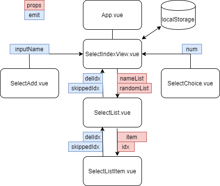

# Who's Next? 제비뽑기

Deploy : [edvue.netlify.app](https://edvue.netlify.app)

## 사용방법

1. 인원 추가
2. 몇 명 뽑을건지 입력하고 뽑기 누르면 끝
   1. 노란색으로 선택 되어짐.
   2. 상단에 랜덤 순서로 목록 제공.
3. 제외 하려는 카드를 클릭하면 뽑기에서 제외됨.
   1. 제외를 전부 취소하려면 상단 Reset Skipped
4. 설정된 제외 목록 및 선택을 초기화 하려면 Reset All
5. 목록에서 삭제하려면 x 를 누르면 됨.
6. localStorage 를 사용해서 새로고침해도 남아 있음.

## 프로젝트 구조

## 사용 요소들

* v-if / v-else / v-for / v-model / v-bind / v-on

* methods / computed (최대 선택 인원 설정할 때 사용/ 카드별 classObject 설정할 때 사용) / watch (스토리지 저장할때 사용)
* lodash (sampleSize 이용한 랜덤 뽑기)

## 기타

* Todo와 유사한 구조로 구성됨.

* 강의할때 답변할 교육생을 선별할때 마다 이용함으로써 

  지속 노출하여 전혀 처음의 날것을 만드는 것이 아닌 

  클론 코딩 형태로 실습이 가능할 것이라 생각하며 해당 프로젝트 작성함.

* 일부 기능(skip, 선택 카드 표현)을 제외하고 기본 제비뽑기만으로 구성 가능.
  * 기본 제비 뽑기
    * 인원 등록 / 인원 삭제 / 한명 뽑기 / 뽑힌 인원 Text로 표시 
    * (뽑을 인원 입력 후 뽑기 / 로컬 스토리지에 저장.)
  * 다른 기능은 교육생들 자발적으로 추가하게 유도 가능
    * 카드 색 바꿔보기, 뽑기 예외 인원 기능

